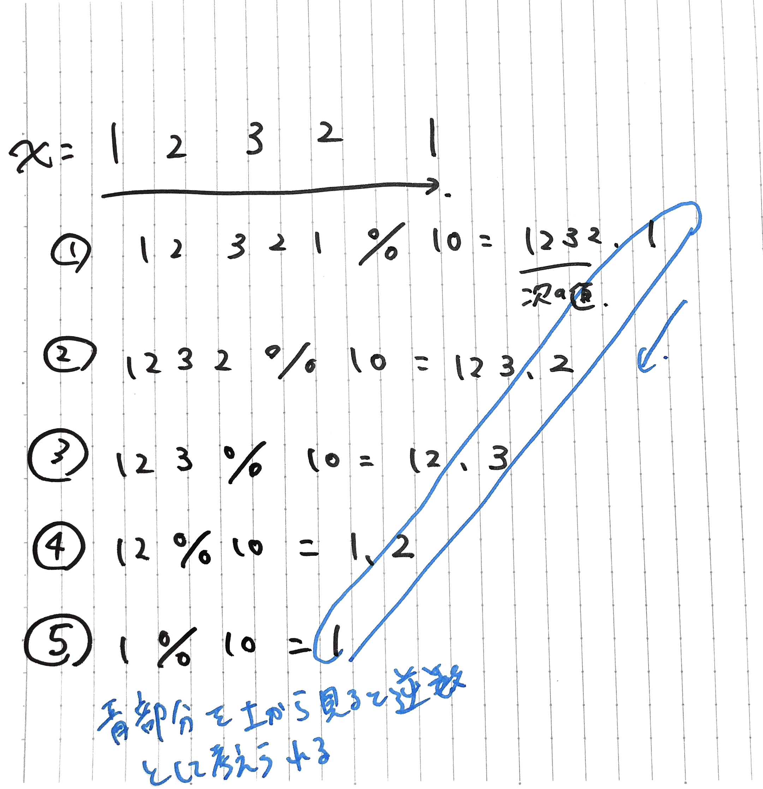

## Palindrome Number

`1234321` のような回文となる数値ならtrueを返す[問題](https://leetcode.com/problems/palindrome-number/)

TypeScriptで一番思いつくのは、文字列にして左右から比較するパターンだと思う(自分もそれでやった)。

他のアプローチとして、値を10ずつ割っていき、余りから逆数を作るパターンがある。

