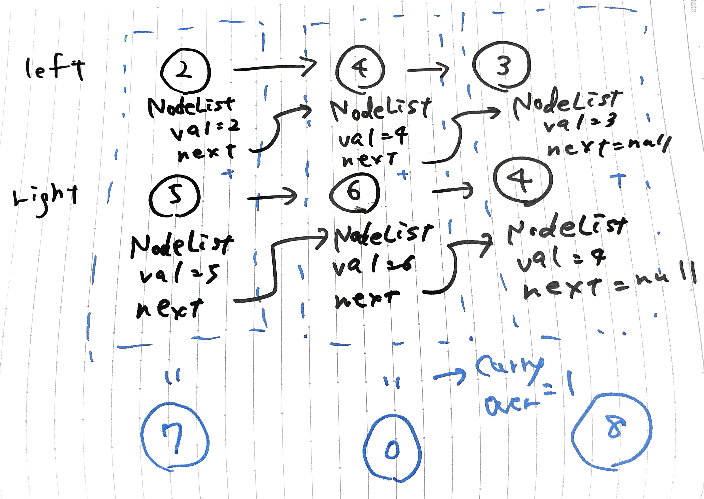
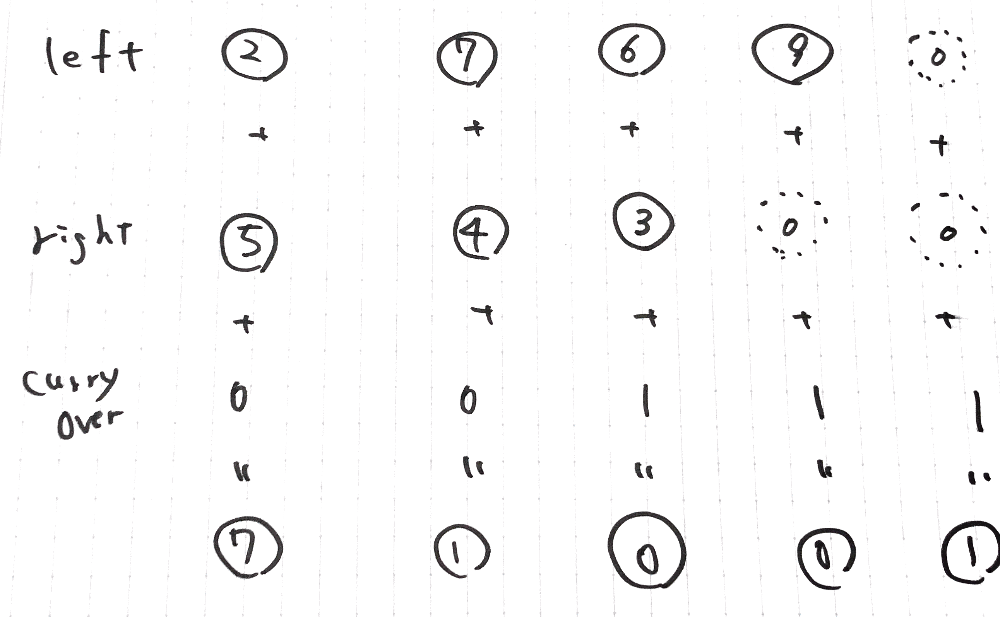

# add two numbers

Linked Listを使用する[問題](https://leetcode.com/problems/add-two-numbers/)。

```text
[input]
2 -> 4 -> 3
5 -> 6 -> 4
[output]
7 -> 0 -> 8
```

今回はこのような流れで計算をしていく



leftとrightの足し算で発生した桁上がり(CurryOver)を次のNodeListの計算に引き継ぐようにし、leftおよびrightのnextがnullかつ、桁上がりが0になるまで繰り返す。桁上がりが1になる場合は、次のNodeListを作成する必要がある。



計算量は、$O(max(m, n))$が基本だが、桁上がりの場合の場合は$O(max(m, n))+1$となる
